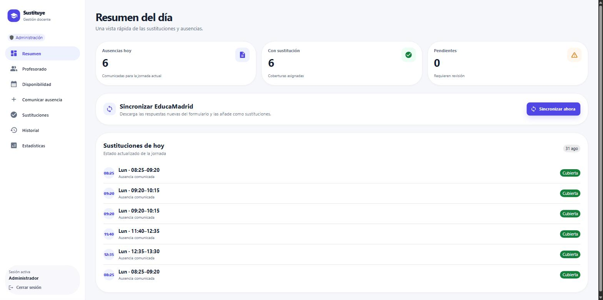
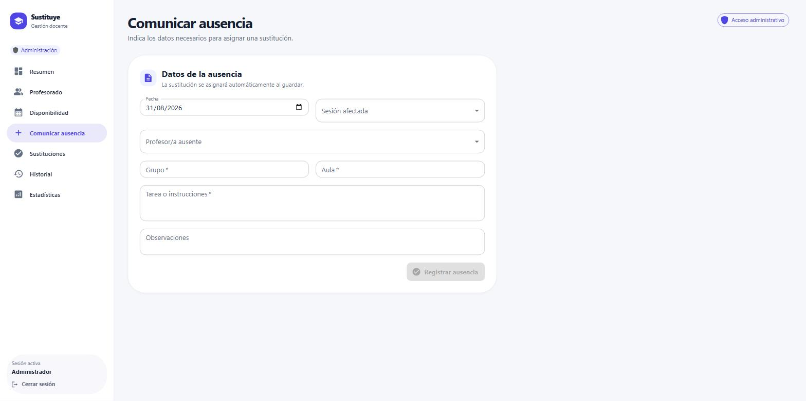
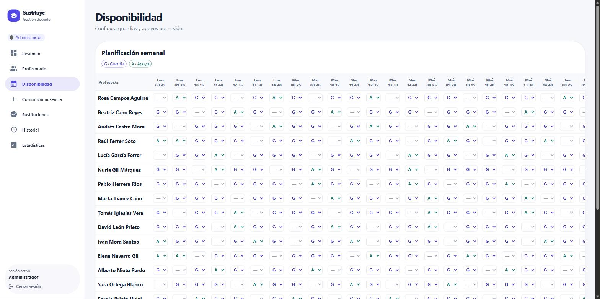
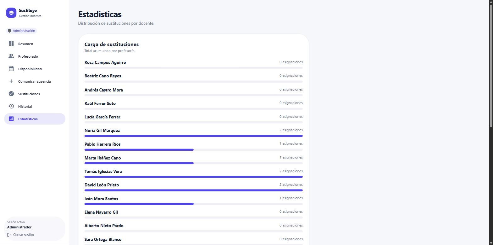
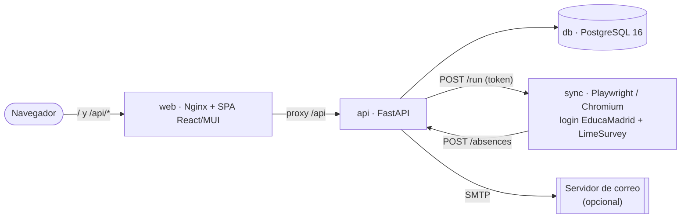

<div align="center">

# 🏫 Sustituye — Gestor de Sustituciones del Profesorado

**Registra ausencias del profesorado y asigna automáticamente la persona sustituta
disponible con menos guardias acumuladas en cada franja horaria semanal.**

[](https://fastapi.tiangolo.com/)
[](https://react.dev/)
[](https://www.postgresql.org/)
[](https://docs.docker.com/compose/)
[](https://docs.pytest.org/)

</div>

---

<div align="center">
  
</div>

---

## 📑 Índice

- [¿Qué resuelve?](#-qué-resuelve)
- [Características](#-características)
- [Capturas](#-capturas)
- [Arquitectura](#-arquitectura)
- [Puesta en marcha](#-puesta-en-marcha)
- [Cuentas y roles](#-cuentas-y-roles)
- [Política de asignación](#-política-de-asignación)
- [Sincronización con EducaMadrid](#-sincronización-con-educamadrid)
- [Notificaciones por email](#-notificaciones-por-email)
- [Estructura del proyecto](#-estructura-del-proyecto)
- [Desarrollo](#-desarrollo)
- [Seguridad](#-seguridad)
- [Licencia](#-licencia)

---

## 🎯 ¿Qué resuelve?

Cuando un profesor o profesora falta, alguien de jefatura de estudios tiene que cubrir
cada una de sus sesiones con el personal de guardia, procurando **repartir la carga con
equidad** a lo largo del curso. Hacerlo a mano con una hoja de cálculo es lento y difícil
de auditar.

**Sustituye** convierte ese proceso en un flujo de dos pasos:

1. Se **comunica la ausencia** (fecha, sesión, grupo, aula, tarea para el alumnado).
2. El sistema **elige la persona sustituta** al instante, siguiendo una política de reparto
   equitativo, actualiza los contadores de guardias y —opcionalmente— **avisa por email**.

Todo queda registrado: historial consultable, estadísticas por docente y sesión, e informe
PDF de guardias y apoyos.

---

## ✨ Características

| Área | Detalle |
|------|---------|
| **Asignación automática** | Elige entre el profesorado de **Guardia** disponible; solo recurre a **Apoyo** cuando no hay ninguna Guardia libre. Desempata al azar entre quienes tienen el contador más bajo en esa sesión. |
| **Reasignación en cascada** | Si quien se ausenta ya estaba cubriendo otra sustitución esa misma franja, esa cobertura se libera y se reasigna con prioridad. |
| **Matriz de disponibilidad** | Rejilla semanal de 7 sesiones × 5 días para marcar cada docente como Guardia (G) o Apoyo (A) por franja. |
| **Portal del profesorado** | Cada docente entra con su email y contraseña y solo puede **comunicar su propia ausencia** y ver sus coberturas. |
| **Dashboard del día** | Ausencias de hoy, cuántas están cubiertas y cuántas quedan pendientes de revisión. |
| **Historial y estadísticas** | Filtro por fechas, docente y grupo; barras de carga acumulada por profesor/a; informe **PDF** de guardias/apoyos por sesión. |
| **Copia de seguridad** | Exportación e importación completa de la base de datos en un archivo JSON desde la propia interfaz. |
| **Inicio de nuevo curso** | Borra sustituciones y estadísticas conservando profesorado, disponibilidad, grupos y aulas. |
| **Sincronización EducaMadrid** | Servicio opcional que inicia sesión en EducaMadrid, descarga las respuestas nuevas del formulario de sustituciones (LimeSurvey) y las importa por la API. |
| **Aviso por email** | Notificación SMTP a la persona sustituta con todos los datos de la cobertura (opcional). |

---

## 📸 Capturas

| Comunicar ausencia | Disponibilidad semanal |
|:---:|:---:|
|  |  |

| Estadísticas de carga | Resumen del día |
|:---:|:---:|
|  |  |

---

## 🧩 Arquitectura



| Servicio | Imagen / stack | Puerto host | Rol |
|----------|----------------|-------------|-----|
| `web` | Nginx 1.27 + build de Vite | **3000** | Sirve la SPA y hace de proxy inverso a `/api`. |
| `api` | Python 3.13 · FastAPI · SQLAlchemy 2 · Alembic | **8000** | Lógica de negocio, autenticación JWT, informes PDF. |
| `db` | `postgres:16-alpine` | — | Persistencia (volumen `postgres_data`). |
| `sync` | Python + Playwright (Chromium) | — (solo red interna) | Importación desde EducaMadrid bajo demanda. |

Al arrancar, `api` aplica las migraciones de Alembic y siembra datos de ejemplo
(20 docentes, grupos, aulas, 7 sesiones diarias de lunes a viernes y su disponibilidad).

---

## 🚀 Puesta en marcha

### Requisitos

- [Docker](https://docs.docker.com/get-docker/) y Docker Compose v2.

### Pasos

```bash
# 1. Configura las variables de entorno
cp .env.example .env
#    edita .env y define un JWT_SECRET largo y aleatorio
#    (y ADMIN_EMAIL / ADMIN_PASSWORD si no quieres los valores por defecto)

# 2. Levanta toda la plataforma
docker compose up --build
```

- **Aplicación:** <http://localhost:3000>
- **Documentación de la API (Swagger):** <http://localhost:8000/docs>

Inicia sesión con las credenciales de administrador
(por defecto `admin@school.local` / `admin123`).

> **Nota:** la primera construcción del servicio `sync` incluye
> `playwright install --with-deps chromium` y puede tardar varios minutos. Si no vas a usar
> la sincronización con EducaMadrid puedes levantar solo lo esencial:
> `docker compose up --build db api web`.

### Reinicios y limpieza

```bash
docker compose down       # detiene los contenedores; conserva la base de datos
docker compose down -v     # además elimina el volumen y regenera los datos de ejemplo
```

---

## 👥 Cuentas y roles

| Rol | Cómo se crea | Puede hacer |
|-----|--------------|-------------|
| **Administrador** | Definido por `ADMIN_EMAIL` / `ADMIN_PASSWORD` en `.env`. | Todo: profesorado, disponibilidad, ausencias, historial, estadísticas, copias de seguridad, sincronización y reinicio de curso. |
| **Profesor/a** | Un administrador le asigna una contraseña (mínimo 8 caracteres) en **Profesorado**. | Iniciar sesión, **comunicar su propia ausencia** y consultar sus sustituciones e historial. |

El profesorado sembrado como ejemplo necesita que un administrador le establezca una
contraseña antes de poder entrar.

---

## ⚖️ Política de asignación

Para cada ausencia registrada, la API:

1. Reúne al profesorado **activo** con disponibilidad en esa sesión, **excluyendo** a quien
   se ausenta y a quien ya cubre otra sustitución esa fecha/franja.
2. Considera primero a las **Guardias**; solo si ninguna está libre pasa a los **Apoyos**.
3. Entre las personas elegibles, elige **al azar** entre las que tienen el **contador más
   bajo** para esa sesión.
4. Incrementa ese contador **de forma atómica** en la misma transacción (`SELECT ... FOR
   UPDATE`), de modo que dos ausencias simultáneas no compitan por la misma persona.
5. Si nadie es elegible, la ausencia queda **sin asignar** y aparece como *pendiente*.

Si la persona ausente ya estaba asignada como sustituta en esa misma franja, esa cobertura
se libera primero y se reasigna con prioridad antes de resolver la ausencia nueva.

La matriz de disponibilidad admite **7 sesiones diarias** de lunes a viernes. La página de
**Estadísticas** permite descargar un **PDF** con las guardias y apoyos de cada docente por
sesión.

---

## 🔄 Sincronización con EducaMadrid

`sync/` es un servicio más de `docker-compose.yml` que:

1. Inicia sesión en EducaMadrid con un **Chromium real** (Playwright) para completar el SSO
   de Keycloak.
2. Descarga el CSV de respuestas del formulario de sustituciones (LimeSurvey).
3. Guarda las respuestas nuevas en `sync/data/` **antes** de tocar la API (para no perder
   nada si algo falla después).
4. Traduce cada respuesta a una ausencia y hace `POST /absences` (que ya asigna sustituto y
   envía el email), llevando un registro de ids ya importados para no duplicar.

Se dispara **bajo demanda**: un administrador pulsa *«Sincronizar EducaMadrid»* en el
Dashboard, o una tarea programada (Task Scheduler / cron) llama al endpoint
`POST /admin/sync-educamadrid`. El contenedor `sync` **no publica ningún puerto**: solo `api`
puede alcanzarlo, y además debe presentar `SYNC_TRIGGER_TOKEN`.

Configuración detallada, mapeo de columnas y primera ejecución supervisada:
👉 **[`sync/README.md`](sync/README.md)**.

---

## ✉️ Notificaciones por email

Para avisar por correo a la persona sustituta, define en `.env` estas variables SMTP
opcionales:

| Variable | Por defecto | Descripción |
|----------|-------------|-------------|
| `SMTP_HOST` | — | Servidor SMTP. Si está vacío, **no se envían correos** (la asignación se crea igual). |
| `SMTP_PORT` | `587` | Puerto SMTP. |
| `SMTP_USERNAME` | — | Usuario de autenticación. |
| `SMTP_PASSWORD` | — | Contraseña / clave de aplicación. |
| `SMTP_FROM` | `SMTP_USERNAME` o `no-reply@localhost` | Remitente del mensaje. |
| `SMTP_USE_TLS` | `true` | STARTTLS. |
| `SMTP_USE_SSL` | `false` | Conexión SSL directa. |

---

## 📁 Estructura del proyecto

```
AppGema/
├── docker-compose.yml         # Orquesta db · api · web · sync
├── .env.example               # Plantilla de variables de entorno
├── backend/                   # API FastAPI
│   ├── app/
│   │   ├── main.py            # Rutas y middleware de autenticación
│   │   ├── models.py          # Modelos SQLAlchemy
│   │   ├── schemas.py         # Esquemas Pydantic
│   │   ├── services.py        # Política de asignación + envío de email
│   │   ├── auth.py            # Hash PBKDF2 + JWT
│   │   ├── backup.py          # Exportar / importar base de datos
│   │   └── seed.py            # Datos de ejemplo
│   ├── alembic/               # Migraciones (001 … 004)
│   └── tests/                 # pytest
├── frontend/                  # SPA React 18 + MUI (Vite)
│   ├── src/main.tsx
│   └── nginx.conf             # Proxy /api → api:8000
├── sync/                      # Servicio de sincronización con EducaMadrid
│   ├── educamadrid_sync/
│   ├── config/field_mapping.example.json
│   └── README.md
└── docs/screenshots/          # Imágenes de este README
```

---

## 🛠️ Desarrollo

### Backend

```bash
cd backend
pip install -r requirements.txt
pytest                     # ejecuta la batería de tests
```

### Frontend

```bash
cd frontend
npm install
npm run dev                # Vite en http://localhost:5173, proxy /api → :8000
```

### Servicio de sincronización

```bash
pytest sync/tests          # cubre mapping.py y state_store.py sin red ni credenciales
```

---

## 🔐 Seguridad

- **Nunca** subas el archivo `.env` real: contiene `JWT_SECRET`, credenciales de
  administrador, SMTP y de EducaMadrid. Está en `.gitignore`; usa `.env.example` como
  plantilla.
- `sync/data/` contiene datos de profesorado y sustituciones (PII) y también está excluido
  del control de versiones.
- Cambia `JWT_SECRET`, `ADMIN_PASSWORD` y `SYNC_TRIGGER_TOKEN` por valores largos y
  aleatorios antes de cualquier despliegue real.
- Las contraseñas del profesorado se almacenan con **PBKDF2-SHA256** (310 000 iteraciones);
  los tokens JWT caducan a las 12 horas.
- Confirma que el uso de automatización del servicio `sync` cumple los términos de uso de
  EducaMadrid en tu centro antes de dejarlo desatendido.

---

## 📄 Licencia
MIT License
